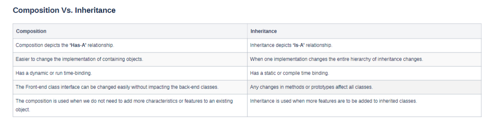

### Association:
- An association is a relationship between two classes.
- They are of the following types.
  - One-to-One: One object is associated with exactly one object. 
  Example: A person is linked with exactly one social security number and vice versa.
  - One-to-Many: One object can be associated with many objects.
  Example: A person can have multiple bank accounts, but a single account is linked to a single person.
  - Many-to-Many: A variable number of objects belonging to a class may be associated with a variable number of objects belonging to another class.
  Example: A person can have multiple home addresses, and a home address may be linked to multiple people.
  - Association has two forms: Composition and Aggregation.
  Objects associated with each other communicate using references to use their properties and characteristics.

### Inheritance 
1. Inheritance is a type of IS-A relationship that indicates one object is a type of another object.
2. It is a technique through which one object of a class acquires the behaviors and properties of another object.
3. For example, a car is a type or kind of vehicle. A car does everything a vehicle can do and stores all the states that a vehicle needs to make these behaviors possible.

### Composition
- The HAS-A relationship in Java is called Composition. By using a “has-a” relationship we ensure code reusability in our programs.
- We make our program use an instance of a class directly instead of extending it from another class as we do in the case of inheritance.
- For example, a car and an Engine share the HAS-A relationship. A car always has an Engine. We do not extend the properties of theEngine object, but we use the Engine object directly.
- The composition is an association in which one class contains another class, and this contained class depends on the containing class in such a way that it cannot exist independently.
- Hence, when the containing object is destroyed, the other object is also destroyed.
- A composition relationship is a “part-of-a-whole” relationship in which the part does not exist without the whole.
- For example, A 'Human' class is a composition of Heart and lungs. When the human object dies, nobody parts exist. The composition is a restricted form of Aggregation. In Composition, one class includes another class and is dependent on it so that it cannot functionally exist without another class.

- 

#### Reference:
- https://www.geeksforgeeks.org/association-composition-aggregation-java/
